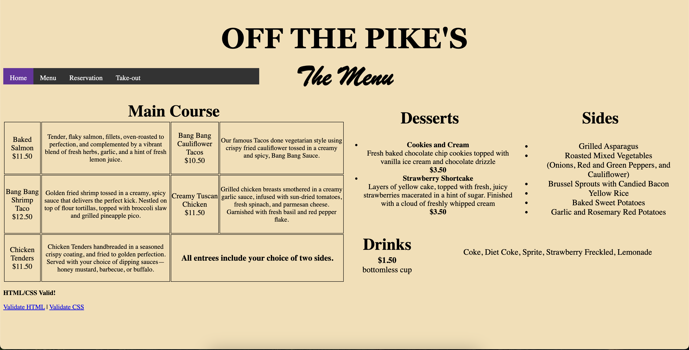

# Off the Pike Project Page

[Website Link](https://tai-yuwang.github.io/Best_Table.github.io/group_2/index.html)

[Repo Link](https://github.com/Tai-YuWang/Best_Table.github.io)

The request method I used was post. The input types I used were mostly the drop down menus because for the main courses, and the sides, there was a lot of options for each. So I didn't want all of the options to cover the entire screen and seem overwhelming.

Sharing the code with others, wasn't super hard, but it sometimes did cause quite a bit of fustration because we would forget to use "git pull". Another problem was using the same style.css page, because we would have to take turns on coding in it, to avoid both of us updating it at the same time, and only one of our codes staying. I think that creating new branches was easier to work on the style.css at the same time, because thiis allowed both of us to work on the style.css and be more produtive. Creating the branch and merging the branch was a little hard to understand, but it wasn't too hard.
